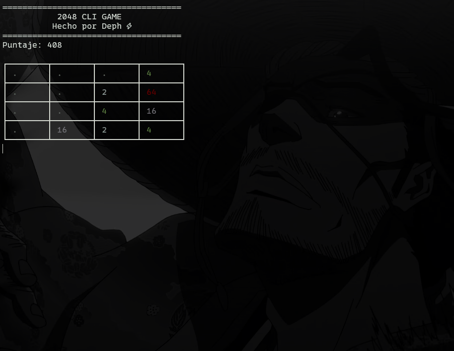

# 2048 CLI Game 🎮

A clone of the classic **2048** game built for the terminal (CLI) in **Node.js**.  
It includes dynamic colors, score history, automatic restart, and real-time arrow key controls.

------------------------------------------------------------------------------------------

## 🚀 Features
- **4x4 board** with original 2048 logic  
- **Dynamic colors** for each tile using `chalk`  
- **Score history** stored during the session  
- **Automatic Game Over detection** with instant restart  
- **Victory detection** when reaching the 2048 tile  
- **Arrow key controls** in real time (no need to press Enter)  

------------------------------------------------------------------------------------------

## 📦 Requirements
- **Node.js v16 or higher** (tested on Node.js v22)  
- **npm** for dependency management  

------------------------------------------------------------------------------------------

## 📥 Installation

```bash
# Clone the repository
git clone https://github.com/yourusername/2048-cli.git
cd 2048-cli

# Install dependencies
npm install cli-table3 chalk@4
```
------------------------------------------------------------------------------------------

⚠️ Note: chalk@4 is recommended because it supports require() in CommonJS.
If you prefer chalk@5, you must switch your project to ESM (import instead of require).
------------------------------------------------------------------------------------------

## ▶️ Usage

```bash
# Run the game
node start.js
```
------------------------------------------------------------------------------------------

## 🎥 Demo

Here’s how the game looks in action:



------------------------------------------------------------------------------------------

## 🎮 Controls

- **← → ↑ ↓ →** Move tiles

- **Ctrl + C** → Exit the game

------------------------------------------------------------------------------------------

## 🎨 Dependencies

- **cli-table3** → Prints the board with a clean grid

- **chalk** → Adds colors to the tiles

------------------------------------------------------------------------------------------

## 🏆 Objective

Combine tiles until you reach 2048.
After that, you can keep playing to reach 4096, 8192… and beyond.

------------------------------------------------------------------------------------------

## 📖 Score History

Each finished game saves your final score in memory and displays it on screen.
(Future improvement: saving scores to a JSON file for persistence)

------------------------------------------------------------------------------------------

## ✨ Credits

Made with passion by Deph ⚡

------------------------------------------------------------------------------------------
